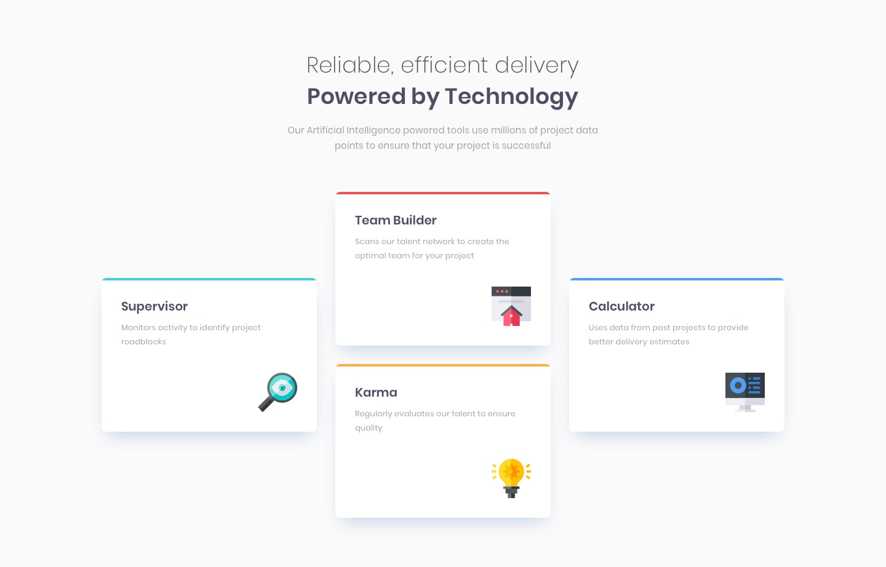

# Four Card Feature Section Master

This project is part of the Frontend Mentor challenges, focusing on mastering responsive design techniques. The goal of this challenge is to create a feature section with four cards, each highlighting a different feature or service. The project emphasizes proficiency in HTML, CSS, and responsive web development.

## Description

The "Four Card Feature Section Master" project showcases my ability to create visually appealing and functional feature sections that adapt seamlessly across various devices and screen sizes. By implementing responsive design techniques, I ensure that the feature section maintains its integrity and usability regardless of the user's device.

## Features

- Responsive layout design ensures optimal viewing experience across desktops, tablets, and smartphones.
- Each card highlights a unique feature or service, with consistent styling and layout.
- Utilizes HTML and CSS to structure and style the feature section, adhering to best practices in frontend web development.

## Technologies Used

- HTML
- CSS

## Preview

## Installation

To view the project locally, you can clone this repository to your machine using the following command:
git clone https://github.com/your-username/four-card-feature-section-master.git

## Usage

1. Open the project folder in your preferred code editor.
2. Open the `index.html` file in a web browser to view the feature section.

## Credits

- Frontend Mentor for providing the design mockup and project specifications.

## License

This project is licensed under the [MIT License](LICENSE).

## Acknowledgements

I would like to thank Frontend Mentor for providing a platform to practice frontend development skills through real-world projects and challenges.
